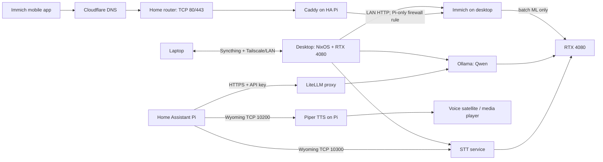

# Desktop services implementation specification

## Purpose

Turn the RTX 4080 desktop into a small, private home-service host for:

1. a bidirectionally synced development workspace with the laptop;
2. speech-to-text (STT) and text-to-speech (TTS) for Home Assistant;
3. a GPU-backed Qwen API; and
4. an Immich photo library that is reachable remotely from the phone.

This design keeps the AI services private to the LAN. Immich is the only
internet-facing application: Cloudflare provides DNS only, and Caddy on the
Home Assistant Raspberry Pi terminates public HTTPS before reverse-proxying to
the private desktop origin.

## Decisions

| Area | Decision |
| --- | --- |
| Host | The desktop is the service host and must remain powered on while its services are expected to work. |
| Service runtime | Use the native NixOS Immich module available in this pinned release and NixOS systemd units for the AI services. Docker remains available for workloads that require a container runtime. |
| Workspace sync | Syncthing between the desktop and laptop, over LAN and Tailscale. It is not a backup. |
| Voice protocol | Wyoming: GPU STT on the desktop at TCP 10300, and Piper TTS locally on the Pi at TCP 10200. Add an OpenAI-compatible transcription endpoint only when a second client actually needs HTTP. |
| LLM interface | Ollama serves a pinned Qwen model locally; LiteLLM exposes an authenticated OpenAI-compatible API to trusted LAN clients. |
| Remote media access | Cloudflare DNS points one public Immich hostname to the home's public IP. Caddy on the Pi terminates HTTPS and reverse-proxies to the desktop's private Immich HTTP endpoint. No other desktop service is published. |
| GPU policy | The Qwen API gets first claim on the GPU. STT and Immich ML are separately rate-limited/queued, rather than relying on all three workloads fitting at peak. |
| Data protection | Immich originals and PostgreSQL receive independent, encrypted, off-host backups. Syncthing versioning protects workspace mistakes but is not a backup strategy. |

## Target architecture



## Network and security model

### Addresses and names

Reserve DHCP leases before implementation:

| Name | Purpose | Required use |
| --- | --- | --- |
| `desktop.lan` | Desktop's stable LAN address | Pi reverse-proxy origin and LAN service clients |
| `home-assistant.lan` | Pi's stable LAN address | Firewall source for STT, LLM, and Immich |
| `immich.<domain>` | Public DNS name | The only public hostname |

Do not use changing DHCP addresses in service configuration. Add the desktop to
the existing Tailscale tailnet so Syncthing can work off-LAN without opening
router ports.

### Exposure rules

| Service | Listener | Who may reach it | Authentication |
| --- | --- | --- | --- |
| Syncthing GUI | `127.0.0.1` only | Local desktop user | Syncthing GUI credentials |
| Syncthing sync | Tailscale/LAN | Paired laptop only | Syncthing device identity |
| Wyoming STT | `desktop.lan:10300` | Pi only | LAN firewall source restriction |
| Wyoming Piper TTS | `127.0.0.1:10200` on Pi | Home Assistant on the same Pi | Loopback only |
| LLM proxy | `desktop.lan:4000` | Pi and explicitly approved LAN clients | Per-client API key |
| Ollama | `127.0.0.1:11434` | LiteLLM only | Not externally reachable |
| Immich | `desktop.lan:2283` | Pi only | Firewall source restriction; Immich account auth |
| Caddy | Pi TCP 80/443 | Public clients for `immich.<domain>` only | Public TLS; Immich account auth |

The desktop firewall must not open these ports to the whole LAN by default.
Use static Pi addresses and source-address rules. The router forwards only TCP
80 and 443 to the Pi; it must have no port-forwarding rules for the desktop.

Use Immich's own accounts, a strong admin password, and MFA where available.
Caddy must serve only the Immich hostname; all other hostnames return 404 or are
not configured.

## Component specifications

### 1. Workspace synchronization

**Implementation:** Syncthing on desktop and laptop, with one explicitly named
folder, initially `/home/alkade/workspace` on each machine.

- Pair device IDs in the Syncthing GUI and require mutual acceptance.
- Run automatic file versioning on both peers: staggered versioning, minimum 30
  days and a size cap agreed before rollout.
- Exclude only disposable artifacts (`.direnv`, build output, language caches)
  from the shared folder. Do not blindly exclude `.git`: Git repositories can be
  synced when only one device edits a checkout at a time, but concurrent changes
  can create Syncthing conflict files.
- Seed the initial copy from the authoritative device while the other peer is
  paused; verify a file-count and checksum sample before enabling two-way sync.
- Use Tailscale for off-LAN syncing. Do not expose Syncthing's sync port to the
  public internet.

**Acceptance criteria:** creating, renaming, deleting, and conflicting a test
file behaves predictably on both devices; the laptop syncs while away from home;
a version can be restored after a deliberate deletion.

### 2. Voice: speech-to-text and text-to-speech

**Initial interface:** `wyoming-faster-whisper` compatible service at
`tcp://desktop.lan:10300`, configured with Swedish and English as required.
Home Assistant connects through its Wyoming integration.

**Model and GPU profile:** begin with `distil-whisper-large-v3` or
`faster-distil-whisper-large-v3`, `compute_type=int8_float16`, a single worker,
and a bounded request queue. Store downloaded models in
`/var/lib/stt/models`; model files do not need backup.

The upstream Wyoming image is CPU-oriented. The implementation must use either
a reproducible CUDA image built in this repository or a maintained CUDA image,
with the Nvidia Container Toolkit/CDI configured on the desktop. It must prove
GPU use via `nvidia-smi` during a transcription. Do not use a random, unpinned
community image in the final deployment.

If a generic HTTP client becomes necessary, add a second, separately
authenticated OpenAI-compatible service on `desktop.lan:8000`; do not publish
it publicly. It must offer `POST /v1/audio/transcriptions` and use the
same model cache or a deliberate separate cache.

**Acceptance criteria:** Home Assistant discovers the Wyoming service, a
30-second Swedish and English test clip completes, and a concurrent LLM request
does not make the voice pipeline time out.

**TTS implementation:** run `wyoming-piper` directly on the Home Assistant Pi
at `tcp://127.0.0.1:10200`. Start with one pinned, local Piper voice per desired
language (for example `sv_SE-*` and `en_US-lessac-medium`), storing models on
the Pi at `/var/lib/wyoming-piper`. Piper is intentionally CPU-only and local:
it is fast enough for short replies, works if the desktop is temporarily busy,
and does not compete for the GPU.

Configure the Home Assistant Wyoming integration with both endpoints, then set
the Assist pipeline to use desktop STT and Pi-local Piper TTS. The end-to-end
response path is: **speech → desktop STT → Home Assistant/AI agent → LiteLLM
and Qwen → Home Assistant → Piper → selected speaker**. Keep initial AI answers
short (two to three sentences) so spoken responses stay useful and fast.

The Piper management web UI remains disabled. If it is ever enabled for voice
testing, bind it only to loopback because it is unauthenticated and can modify
downloaded voice files.

**TTS acceptance criteria:** Home Assistant discovers Piper through Wyoming;
an AI response is spoken on the selected media player; Swedish and English test
phrases are intelligible; and the first audio begins within the agreed latency
budget after Qwen finishes responding.

### 3. Qwen API

**Implementation:** Ollama runs as an unprivileged, system-managed service with
its model storage at `/var/lib/ollama`. Pin both the Qwen model tag/digest and
the Ollama version in configuration. Initial model: a 7–8B Qwen instruct model
in a 4-bit quantization; keep context at 8k tokens initially. This fits far more
reliably in the RTX 4080's 16 GB of VRAM than a larger model while Immich/STT
also exist.

LiteLLM is the only network listener for the model. It forwards to Ollama on
loopback and exposes an OpenAI-compatible endpoint at
`https://desktop.lan:4000/v1`. Store its master key in SOPS/agenix, never in the
Git repository, and configure a separate key for Home Assistant.

Set these operating limits:

- one generation at a time initially;
- maximum 8k context and 1k generated tokens per request;
- a 60-second upstream request timeout;
- reject unauthenticated requests and log request metadata, never prompts or
responses;
- use a health endpoint and restart on failure, not on normal model eviction.

The implementation must expose the model name through `GET /v1/models` and
serve `POST /v1/chat/completions` to a test client. It must record baseline
tokens/second and VRAM use for the selected model.

### 4. Immich and remote phone uploads

**Implementation:** use the native NixOS Immich module, with its configuration
in this repository and runtime secrets in `/etc/immich/immich.env` (root-owned,
mode 0600). Pin the flake input rather than tracking a container `latest` tag.

| Data | Location | Handling |
| --- | --- | --- |
| Originals/uploads | `/srv/immich/library` on a local Btrfs subvolume | Primary data; snapshot and back up |
| PostgreSQL data | `/var/lib/immich/postgres` on local NVMe | Never a network share; back up with logical dumps and filesystem backup |
| Redis/cache | Compose volume | Re-creatable; no standalone backup |
| ML model cache | `/var/lib/immich/model-cache` | Re-creatable; optional backup |

Enable the Nvidia CUDA Immich ML image only after Qwen and STT have working
limits. Immich jobs are batch work: configure their concurrency low, schedule
large backfills overnight, and pause them if Qwen/voice latency is important.

Caddy runs on the Pi as a system service and listens publicly on TCP 80/443.
Cloudflare has a DNS-only record for `immich.<domain>` that resolves to the
home's public IP. Caddy obtains and renews the public TLS certificate using the
HTTP-01 challenge, then reverse-proxies that hostname to
`http://desktop.lan:2283`. Configure an explicit upstream dial timeout and
health response; preserve the original host and forwarding headers. The
desktop's firewall permits port 2283 only from the Pi's LAN address. Verify
uploads and video playback on Wi-Fi and cellular networks before migrating an
existing library.

The initial Caddyfile is deliberately a single site:

```caddyfile
immich.<domain> {
  reverse_proxy http://desktop.lan:2283 {
    health_uri /api/server/ping
    transport http {
      dial_timeout 5s
    }
  }
}
```

Caddy terminates public HTTPS and must receive routes only for Immich; it must
not proxy the LLM, STT, Syncthing, or its own admin API. Firewall the Pi to
allow inbound TCP 80/443 only; Caddy's administrative API remains on loopback.

**Internet exposure gate:** DNS-only Cloudflare does not proxy uploads; remote
traffic goes directly to the Pi and therefore consumes the home's upstream
bandwidth. Before enabling routine phone backup, confirm that the ISP provides a
public reachable address (not CGNAT), that its terms permit self-hosting, and
that the available upstream bandwidth is adequate for video uploads. Use a
dynamic-DNS update mechanism if the public IP changes. If public exposure is not
acceptable, use Tailscale on the phone for Immich remote access instead.

**Acceptance criteria:** the iOS/Android client can sign in remotely, upload a
photo and a short video, background backup resumes after switching networks,
and the desktop receives no inbound router traffic.

## Operations and resilience

### GPU scheduling

The 4080 is shared; it is not partitioned. Start the following way:

1. reserve the Qwen model in VRAM only while the API has recent traffic;
2. permit exactly one STT transcription worker;
3. run Immich ML at one worker and only during a configured batch window;
4. observe `nvidia-smi`/`nvtop`, request queue lengths, and latency before
   increasing any concurrency.

If OOM or latency occurs, reduce Qwen context/model size before increasing
container memory limits. GPU container limits are not a reliable memory
partitioning mechanism.

### Backup and restore

- Take Btrfs snapshots of `/srv/immich/library` and `/var/lib/immich` before
  upgrades.
- Nightly: logical PostgreSQL dump plus encrypted Restic backup of the library,
  Compose configuration, and dump to independent off-host storage.
- Daily: encrypted Restic backup of the Syncthing workspace. Versioning alone
  does not protect against disk failure, propagated corruption, or ransomware.
- Keep backup encryption keys in the existing secrets workflow, with a recovery
  copy outside the desktop.
- Quarterly: restore an Immich database and a sample of originals into an
  isolated temporary directory; document the measured recovery procedure.

### Upgrade policy

- Pin container image versions/digests; upgrade one component at a time in a
  maintenance window.
- Snapshot before Immich upgrades and read its release notes for database
  migration requirements.
- Test configuration changes with `nixos-rebuild build --flake .#desktop`
  before switching.
- Keep service configuration, systemd units, Compose files, and firewall rules
  in this repository; keep tokens, passwords, and API keys in an encrypted
  secret store.

## Delivery plan

1. **Foundation:** reserve addresses, enable Tailscale on desktop, add secrets
   management, Docker Compose, Nvidia container support, directories, firewall
   rules, monitoring, and backup target.
2. **Workspace:** deploy and verify Syncthing before any large service data is
   placed on the desktop.
3. **LLM:** deploy Ollama + LiteLLM, pin a Qwen 7–8B model, benchmark and lock
   limits.
4. **Voice:** deploy the reproducible CUDA Wyoming STT service on the desktop
   and Piper on the Pi; configure and test the full Home Assistant Assist
   pipeline. Add generic HTTP transcription only if required.
5. **Immich LAN:** deploy Immich locally, create accounts, test library import,
   backups, restore, and CUDA ML.
6. **Remote Immich:** create the DNS-only Cloudflare record, forward TCP 80/443
   to Caddy on the Pi, apply the desktop source firewall rule, then test phone
   upload and video behavior.
7. **Handover:** document versions, service URLs, secret rotation, upgrade and
   recovery runbooks.

## Inputs required before implementation

- Authoritative workspace path and approximate size/file count.
- Desktop RAM, available local NVMe capacity, and the off-host backup target.
- LAN subnet, static/DHCP-reserved addresses, and the Raspberry Pi address.
- Domain hosted at Cloudflare, public-IP/CGNAT status, and a dynamic-DNS plan if
  the home address changes.
- Desired STT/TTS languages and Piper voice(s), maximum acceptable end-to-end
  voice latency, and whether an HTTP transcription API is needed in addition to
  Home Assistant's Wyoming protocol.
- Desired Qwen model quality versus latency, expected clients, and whether
  prompts/responses may be logged at all.

## References

- [Immich requirements](https://docs.immich.app/install/requirements/) and
  [CUDA ML setup](https://docs.immich.app/features/ml-hardware-acceleration/)
- [Cloudflare DNS record management](https://developers.cloudflare.com/dns/manage-dns-records/how-to/create-dns-records/)
  and [Caddy reverse proxy](https://caddyserver.com/docs/caddyfile/directives/reverse_proxy)
- [Wyoming Faster Whisper](https://github.com/rhasspy/wyoming-faster-whisper)
- [Wyoming Piper](https://github.com/OHF-Voice/wyoming-piper) and
  [Home Assistant's Wyoming integration](https://www.home-assistant.io/integrations/wyoming/)
- [OpenAI-compatible Faster Whisper Server](https://github.com/lightforgemedia/faster-whisper-server)
